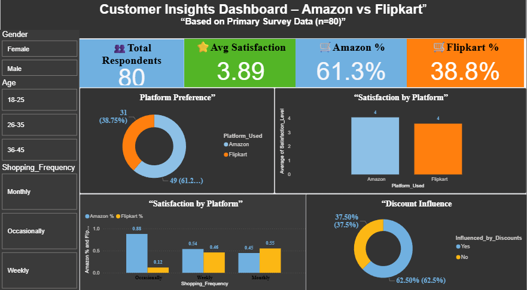
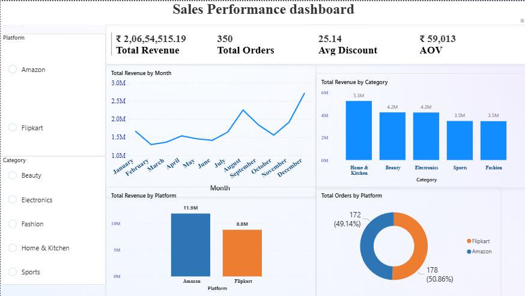
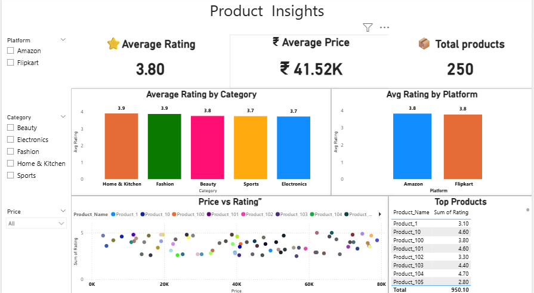

# 🛒 Amazon vs Flipkart E-commerce Analytics

## 📊 Project Overview

This project presents an end-to-end e-commerce analytics comparison between Amazon and Flipkart.

The analysis combines customer survey data, sales performance data, and product-level information to understand customer preferences, satisfaction, revenue performance, product ratings, pricing, discounts, and platform performance.

The project uses Microsoft Excel and Power BI to transform raw data into meaningful business insights through interactive dashboards.

---

## 🎯 Project Objectives

- Compare Amazon and Flipkart platform performance
- Analyze customer preferences and satisfaction
- Understand shopping frequency and customer behavior
- Analyze revenue and order performance
- Compare product ratings across platforms and categories
- Analyze pricing and discount patterns
- Identify high-performing product categories
- Generate actionable business insights

---

# 📈 Interactive Dashboards

## 1. 👥 Customer Insights Dashboard

This dashboard analyzes customer behavior and preferences based on survey responses from 80 respondents.

### Key Metrics

- Total Respondents: **80**
- Average Satisfaction: **3.89**
- Amazon Preference: **61.3%**
- Flipkart Preference: **38.8%**

### Analysis Includes

- Platform preference
- Satisfaction by platform
- Shopping frequency
- Discount influence
- Customer satisfaction

### Dashboard Preview



---

## 2. 💰 Sales Performance Dashboard

This dashboard analyzes revenue, orders, discounts, categories, and platform-level sales performance.

### Key Metrics

- Total Revenue: **₹2,06,54,515.19**
- Total Orders: **350**
- Average Discount: **25.14**
- Average Order Value: **₹59,013**

### Analysis Includes

- Monthly revenue trends
- Revenue by category
- Revenue by platform
- Orders by platform
- Sales performance comparison

### Dashboard Preview



---

## 3. 📦 Product Insights Dashboard

This dashboard analyzes product ratings, pricing, product counts, and category-level product performance.

### Key Metrics

- Average Rating: **3.80**
- Average Price: **₹41.52K**
- Total Products: **250**

### Analysis Includes

- Average rating by category
- Average rating by platform
- Price vs rating analysis
- Product-level rating analysis
- Product comparison

### Dashboard Preview



---

# 🔍 Key Business Insights

### 👥 Customer Insights

- Amazon has a higher platform preference among the surveyed respondents.
- The overall average customer satisfaction score is **3.89**.
- Discounts influence purchasing decisions for a significant proportion of respondents.
- Customer shopping frequency varies across weekly, monthly, and occasional shoppers.

### 💰 Sales Insights

- Amazon generates higher total revenue than Flipkart in the analyzed dataset.
- Revenue varies across different months.
- Home & Kitchen is one of the strongest-performing categories by revenue.
- Amazon accounts for slightly more orders than Flipkart in the analyzed sales data.

### 📦 Product Insights

- The overall average product rating is approximately **3.80**.
- Average ratings between Amazon and Flipkart are very similar.
- Product prices vary considerably across categories.
- The dataset contains **250 products**.

---

# 🗂️ Dataset

The project contains three major analytical datasets.

### Customer Survey

Includes:

- Gender
- Age
- Platform Used
- Shopping Frequency
- Satisfaction Level
- Platform Preference
- Discount Influence

### Product Data

Includes:

- Product Name
- Platform
- Category
- Price
- Rating
- Product information

### Sales Data

Includes:

- Order information
- Platform
- Category
- Revenue
- Discount
- Order value
- Monthly sales

---

# 🛠️ Tools & Technologies

- Microsoft Excel
- Power BI
- Excel Pivot Tables
- Data Cleaning
- Data Analysis
- Data Visualization
- Dashboard Development
- Business Analytics

---

# 📁 Project Structure

```text
amazon-vs-flipkart-ecommerce-analytics/
│
├── data/
│   └── ecommerce_analytics_dataset.xlsx
│
├── dashboard/
│   ├── customer-insights-dashboard.png
│   ├── sales-performance-dashboard.png
│   └── product-insights-dashboard.png
│
├── powerbi/
│   ├── product-insights-dashboard.pbix
│   ├── sales-performance-dashboard.pbix
│   └── customer-insights-dashboard.pbix
│
└── README.md
